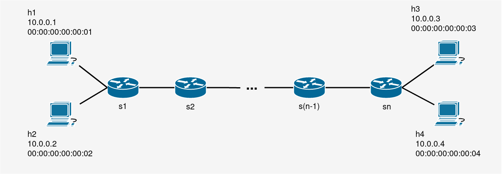

# FIUBA Redes TP3

## Instalar dependencias

```console
$ pip3 install poetry
$ poetry config virtualenvs.in-project true
$ poetry install
```

Si no se reconocen las dependencias, podes cambiar manualmente al entorno virtual (venv) ejecutando el comando:

```console
$ poetry shell
```

### Mininet

Visitá la [documentación de mininet](http://mininet.org/download/) para comenzar con mininet.

#### Notas

- No necesitas una VM si usas Linux, solo ejecutá `sudo apt install mininet`
- Si utilizas VirtualBox, vas a necesitar abrir un puerto para conectarte a la VM (NAT Adapter)

## Topología

### Descripción

La topología consiste en _4_ hosts y _n_ switches:

| Host | IP Addr  |     MAC Addr      | Attached to |
| :--: | :------: | :---------------: | :---------: |
|  h1  | 10.0.0.1 | 00:00:00:00:00:01 |     s1      |
|  h2  | 10.0.0.2 | 00:00:00:00:00:02 |     s1      |
|  h3  | 10.0.0.3 | 00:00:00:00:00:03 |     sn      |
|  h4  | 10.0.0.4 | 00:00:00:00:00:04 |     sn      |



### Ejecutando la topología

El código para crear la topología se encuentra en el archivo `linear_topo.py`. Para ejecutarlo, utilizar:

```console
$ sudo python linear_topo.py
```

## Firewall

### Ejecutar el firewall

El código para crear el firewall se encuentra en `pox/pox/ext/firewall.py`.
Para ejecutarlo, utilizar:

```console
$ poetry run ./pox/pox.py log.level --DEBUG openflow.of_01 forwarding.l2_learning firewall
```

Se puede añadir el parámetro `--rules={archivo de reglas}` al final del comando para cambiar el archivo de reglas.

### Configurando el firewall

El firewall se configura editando el archivo `firewall_rules.json` por defecto. Este archivo contiene una lista de reglas para el firewall.

#### Ejempplos de reglas

- Bloquear todo el tráfico del host 1 al host 2 utilizando sus direcciones MAC

  ```json
  {
    "rules": [
      {
        "eth": ["00:00:00:00:00:01", "00:00:00:00:00:02"]
      }
    ]
  }
  ```

- Bloquear todo el tráfico TCP al puerto 80

  ```json
  {
    "rules": [
      {
        "tcp": {
          "dst": "80"
        }
      }
    ]
  }
  ```

- Bloquear todo los paquetes originados en el host 1 que utilicen UDP y que el puerto destino sea 5001

  ```json
  {
    "rules": [
      {
        "ipv4": {
          "src": "10.0.0.1"
        },
        "udp": {
          "dst": "5001"
        }
      }
    ]
  }
  ```

- Bloquear todos los paquetes del protocolo IPv6

  ```json
  {
    "rules": [
      {
        "type": "IPv6"
      }
    ]
  }
  ```

- Bloquear todos los paquetes del protocolo IPv4 con un TOS (Type of Service) de 15, cuyo destino sea el host 3

  ```json
  {
    "rules": [
      {
        "ipv4": {
          "tos": 15,
          "dst": "10.0.0.3"
        }
      }
    ]
  }
  ```

Aunque sea obvio, notar que el firewall va a bloquear únicamente el tráfico si el paquete pasa porste. Si se establece el firewall en el switch s1, y se bloquea el tráfico entre el host h3 y h4, entonces no se va a bloquear nada.

## Scripts

Para ejecutar los scripts, es necesario abrir 2 terminales y un comando en cada una en el orden indicado.

### Pingall

1. `./scripts/l2_learning.sh`
2. `./scripts/topo.sh pingall`
   - `number of switches`: **2**

**Resultado esperado:** Se crean los hosts con 2 switches, y son exitosos todos los pings.

### Iperf

#### TCP puerto 80

1. `./scripts/firewall.sh`
2. `./scripts/topo.sh iperf`
   - `number of switches`: **2**
   - `server host number`: **1**
   - `client host number`: **4**
   - `port`: **80**

**Resultado esperado:** Client could not connect to server (firewall bloquea puerto 80)

#### Server

```console
$ iperf -s -p <port> -i 1
```

#### Client

```console
$ iperf -c <server_ip> -p <port> -t <transmission_duration>
```

For more information, see: [How to use iperf over mininet?](http://csie.nqu.edu.tw/smallko/sdn/iperf_mininet.htm)

## Additional resources

- [POX](https://noxrepo.github.io/pox-doc/html/)
- [Iperf](https://iperf.fr/)

### Troubleshooting

#### Error creating interface (File exists)

Error:

```
Traceback (most recent call last):
  File "linear_topo.py", line 53, in <module>
    main()
  File "linear_topo.py", line 49, in main
    linear_topo(n_switches)
  File "linear_topo.py", line 27, in linear_topo
    net.addLink(switches[i], switches[i + 1])
  File "/usr/local/lib/python3.8/dist-packages/mininet/net.py", line 406, in addLink
    link = cls( node1, node2, **options )
  File "/usr/local/lib/python3.8/dist-packages/mininet/link.py", line 456, in __init__
    self.makeIntfPair( intfName1, intfName2, addr1, addr2,
  File "/usr/local/lib/python3.8/dist-packages/mininet/link.py", line 501, in makeIntfPair
    return makeIntfPair( intfname1, intfname2, addr1, addr2, node1, node2,
  File "/usr/local/lib/python3.8/dist-packages/mininet/util.py", line 270, in makeIntfPair
    raise Exception( "Error creating interface pair (%s,%s): %s " %
Exception: Error creating interface pair (s1-eth1,s2-eth1): RTNETLINK answers: File exists
```

Solution:

You can see the open interfaces with:

```console
$ ip link
```

And delete the conflicting interfaces:

```console
$ sudo ip link delete s1-eth1
$ sudo ip link delete s2-eth1
```
